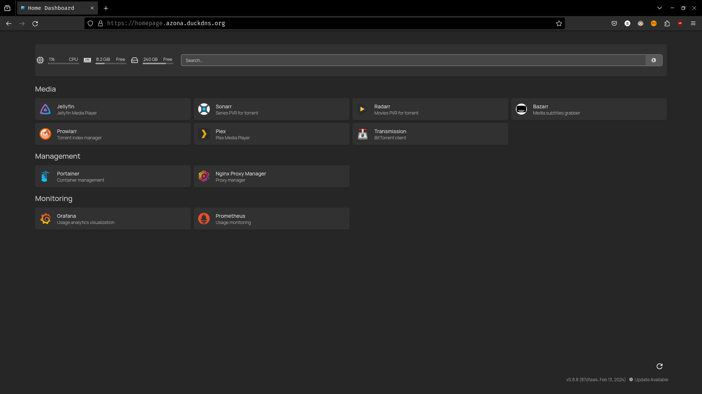
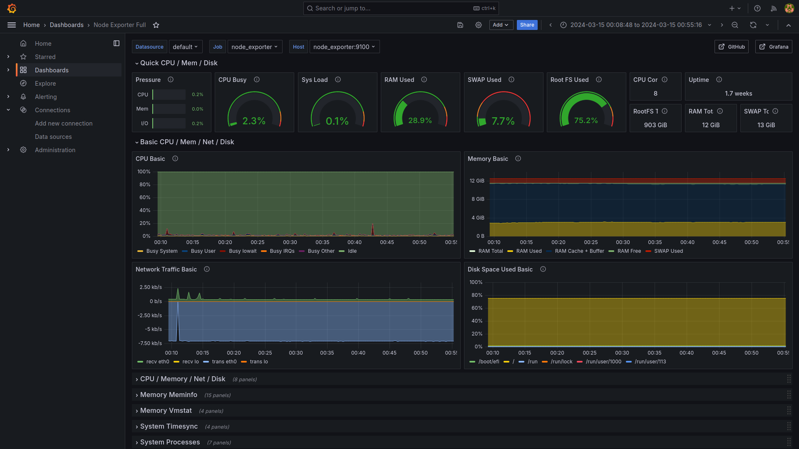
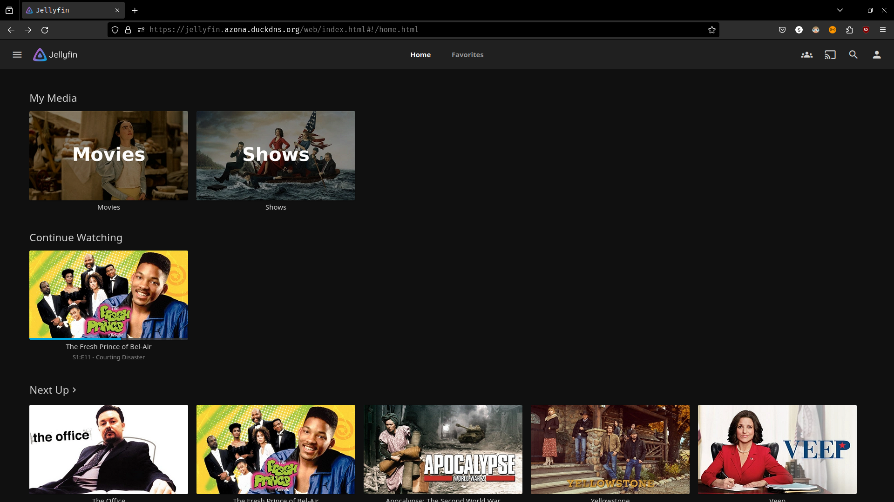

# Mantinhas' Homelab

## Overview

This projects contains the docker compose files used to deploy my self-hosted home server for a single host machine, a 10-year old laptop I had hanging arround. Including:

1. Media server, attached to transmission torrent client and the _arr_ stack for media management
2. Management tools such as Nginx and Portainer
3. Monitoring system utilizing Grafana and Prometheus

## Screenshots





## Deployment

For deployment follow these steps:

1. Configure a `.env` file with variables corresponding to the variables declared in the [homepage configuration file](https://github.com/mantinhas/homelab/blob/main/docker-compose/homepage/config/services.yaml). This only requires looking at the published ports, and the IP of the host machine, and adding variables such as: `HOMEPAGE_VAR_JELLYFIN_URL=192.168.1.10:8096`

2. Go into each of the folders in `docker-compose` directory, for example, `homepage`

``` cd homepage```

3. Run the docker compose

``` docker compose up -d ```

4. Open each of the web interfaces and configure admin accounts

5. Repeat for each service
